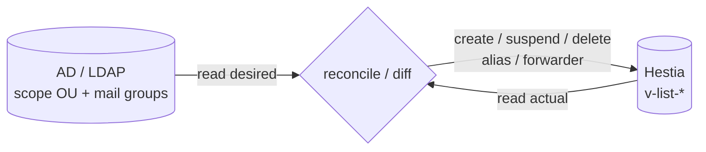

# AD → Hestia/SOGo provisioning bridge (`fachex-sync`)

The piece that makes "create a user in AD → they instantly have mail" real.

## Principle: stateless reconciliation

The bridge keeps **no database of its own**. Every cycle it computes:

- **Desired state** = mailbox-enabled users + mail groups from **AD** (LDAP).
- **Actual state** = mail accounts + aliases + forwarders from **Hestia**
  (`v-list-*` commands / API).
- **Diff** → apply the minimum set of `v-add-*` / `v-suspend-*` / `v-delete-*`
  / alias operations to converge.

Idempotent, crash-safe, and re-runnable. If it dies mid-cycle, the next cycle
fixes up. No drift accumulation.



## Why Go

Single static binary, trivial to drop on a Debian LXC, solid LDAP + HTTP
libraries, and a long-lived daemon with a ticker loop is idiomatic. (Python
would be more readable if you'd rather hack on it casually — the logic ports
directly; say the word.)

## Talking to Hestia

Two supported transports — pick one in config:

1. **Hestia API** (recommended): `POST https://<hestia>:8083/api/` with an
   **access key/secret** (Hestia 1.6+), `returncode=yes`, `cmd=v-...`,
   `arg1..argN`. No SSH exposure.
2. **SSH** to the Hestia host running the `v-*` CLI under a restricted sudoers
   entry. Use if you prefer not to expose the API port.

Commands used:

| Action | Command |
|---|---|
| List domains for a Hestia user | `v-list-mail-domains <user> json` |
| List accounts | `v-list-mail-accounts <user> <domain> json` |
| Create mailbox | `v-add-mail-account <user> <domain> <acct> <randpass> [quota]` |
| Add alias | `v-add-mail-account-alias <user> <domain> <acct> <alias>` |
| Delete alias | `v-delete-mail-account-alias <user> <domain> <acct> <alias>` |
| Suspend (disabled in AD) | `v-suspend-mail-account <user> <domain> <acct>` |
| Unsuspend | `v-unsuspend-mail-account <user> <domain> <acct>` |
| Delete (after retention) | `v-delete-mail-account <user> <domain> <acct>` |
| Forwarder (distribution list) | `v-add-mail-account-forward <user> <domain> <acct> <member@…>` |

> Mail accounts in Hestia live under a Hestia **owner user** that holds the
> domain. The bridge config maps each mail **domain → its Hestia owner**.

## What counts as "mailbox-enabled" in AD

To avoid provisioning service accounts/computers, a user is in scope only if it
matches **all** of:

- located under a configured scope (OU subtree or member of `grp-mail-enabled`),
- `objectClass=person`, not a computer/service account,
- has a `mail` attribute whose domain is one of the managed Hestia domains.

## Mapping rules

| AD | Hestia action |
|---|---|
| In-scope user with `mail=user@dom` | Ensure `v-add-mail-account` exists; set quota from AD attr (e.g. `msExchMailboxQuota`) or default; set random password (AD is the real authority via Dovecot LDAP passdb). |
| `proxyAddresses: smtp:alias@dom` | Ensure account alias exists; remove aliases no longer present. |
| `userAccountControl` ACCOUNTDISABLE bit set | `v-suspend-mail-account`. |
| Re-enabled | `v-unsuspend-mail-account`. |
| Out of scope / deleted | Suspend immediately; delete after `retentionDays` (config). Never hard-delete on first miss — guards against AD blips. |
| Mail-enabled group `dl@dom` with members | Represent as a Hestia account (or alias target) with forwarders to each member's primary address; reconcile membership. |

## Config (sketch — `config.yaml`)

```yaml
ad:
  uri: ldaps://dc1.corp.example.com
  bindDN: CN=svc-mail,OU=Service Accounts,DC=corp,DC=example,DC=com
  bindPasswordEnv: FACHEX_AD_PASSWORD
  userScope: "OU=Mail Users,DC=corp,DC=example,DC=com"
  groupScope: "OU=Distribution Lists,DC=corp,DC=example,DC=com"
  enabledByGroup: ""              # optional: require membership of this group DN

hestia:
  transport: api                  # api | ssh
  api:
    url: https://hestia.corp.example.com:8083/api/
    accessKeyEnv: FACHEX_HESTIA_KEY
    secretKeyEnv: FACHEX_HESTIA_SECRET
  domainOwners:                   # mail domain -> Hestia owner user
    example.com: corpmail
    example.net: corpmail

sync:
  interval: 120s
  defaultQuota: "5G"
  retentionDays: 30               # grace before deleting a vanished account
  dryRun: true                    # flip to false to apply
```

## Triggering: poll vs. push

- **Default: poll** every `interval` (e.g. 2 min). Simple, robust, no AD-side
  install, keeps working if the DC is briefly unreachable. Use an LDAP
  incremental filter on `whenChanged`/`uSNChanged` for cheap cycles.
- **Optional near-instant push:** a PowerShell scheduled task on the DC reacting
  to user-creation events (Event ID 4720) hits a `fachex-sync` webhook to force
  an immediate reconcile. Nice-to-have on top of polling, not a replacement.

## Safety rails

- **`dryRun` first** — log the planned diff, eyeball it, then enable apply.
- **Never delete on a single miss** — suspend + retention window.
- **Rate/again-limit** destructive ops; alert if a cycle would change more than
  N accounts (protects against an AD query returning empty by mistake).
- **Structured log + `last_success` metric** for monitoring.

## Repo layout (when we build it)

```
provisioning/
  cmd/fachex-sync/main.go
  internal/ad/         # LDAP queries -> desired state
  internal/hestia/     # API + SSH transports, v-* wrappers
  internal/reconcile/  # diff + apply, dry-run
  internal/config/
  config.example.yaml
  systemd/fachex-sync.service
```

## Next step

Build order once you approve: (1) read-only AD lister, (2) Hestia client +
`v-list-*` actual-state reader, (3) reconcile/diff in dry-run, (4) enable apply,
(5) aliases + groups, (6) webhook push. Each is independently testable.
