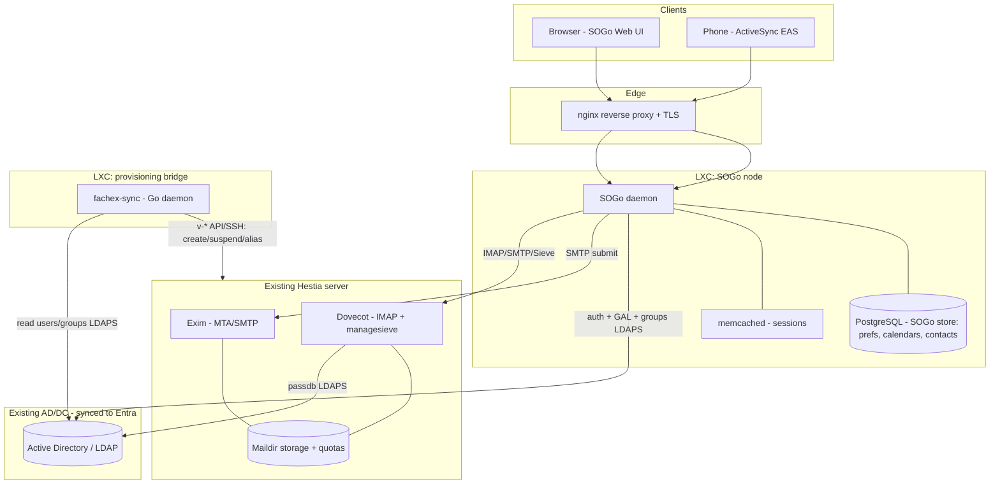

# Architecture

## High-level

## Component placement on the 9-node Proxmox cluster

| Component | Where | Notes |
|---|---|---|
| **SOGo + memcached + PostgreSQL** | New LXC (Debian 12) | Keep separate from Hestia so panel upgrades never clobber it. Postgres holds SOGo's own data (calendars, contacts, prefs) — **not** mail. |
| **Exim + Dovecot + Maildir** | Existing Hestia server | Unchanged role: MTA + mailbox store. We only add an LDAP `passdb` and enable managesieve. |
| **fachex-sync (provisioning bridge)** | Small LXC (Debian 12) | Stateless Go daemon, reconcile loop AD → Hestia. |
| **AD/DC** | Existing (Entra-synced) | Single source of truth. We only read from it. |
| **nginx** | Existing reverse proxy | Terminates TLS for `mail.*`, `autodiscover.*`, `autoconfig.*`. |

Co-locating SOGo on the Hestia box is possible but **not recommended**: Hestia
owns its own web stack and rewrites configs on upgrade. A dedicated LXC keeps
the boundary clean and lets you snapshot/scale SOGo independently.

## The authentication & SSO model (the crux)

We deliberately **split Dovecot's `passdb` and `userdb`**:

- **`passdb` → AD (LDAPS).** Password verification happens against Active
  Directory. This is what gives single sign-on.
- **`userdb` → Hestia passwd-file.** Mailbox location, UID/GID, and quota still
  come from Hestia, so the panel remains the mailbox manager.

Login flow:

1. User opens SOGo and enters their **AD** username + password.
2. SOGo validates the bind against AD (its LDAP source) — this also powers the
   Global Address List and group membership.
3. SOGo opens the user's IMAP/SMTP/Sieve session against Dovecot/Exim, passing
   **the same password through**.
4. Dovecot's LDAP `passdb` validates that password against AD again; its
   `userdb` (Hestia) says where the mailbox lives and what the quota is.

Result: **one AD password everywhere, no master-user plumbing, no password
sync.** Because ActiveSync is served by SOGo's own EAS endpoint (not Dovecot
directly), phones authenticate against AD through SOGo and inherit the same SSO.

> The Hestia mail account still exists (so `userdb` + Maildir + Exim routing
> exist), but its locally-stored password is never used for login — the bridge
> sets it to a random value at provisioning time.

### Why not OIDC/SAML SSO against Entra directly?

Cleaner on paper, but SOGo can't then pass a password to IMAP, forcing Dovecot
**master-user** auth and breaking native-password ActiveSync. Password
pass-through against on-prem AD is simpler, has no cloud runtime dependency, and
keeps working during an Entra/internet outage. We can revisit OIDC later if you
want MFA at the SOGo front door (see `docs/roadmap.md`).

## Identity mapping (AD → mail world)

| AD object / attribute | Maps to |
|---|---|
| User with `mail` in a managed domain | Hestia mail account + SOGo login |
| `proxyAddresses` (`smtp:` entries) | Hestia account aliases |
| Mail-enabled **group** | Hestia forwarder (server-side distribution list) |
| Security/distribution **group** membership | SOGo group → calendar/folder sharing & ACL |
| `userAccountControl` disabled bit | Suspend Hestia account (mail stops, data retained) |
| User removed from scope OU / deleted | Suspend then delete per retention policy |

## Data ownership summary

- **AD** owns identity, passwords, group membership, aliases (`proxyAddresses`).
- **Hestia** owns domains, mailbox storage, quotas, Exim routing, DKIM.
- **SOGo/PostgreSQL** owns calendars, contacts, preferences, filters metadata.
- **fachex-sync** owns nothing — it reconciles AD's desired state into Hestia.
